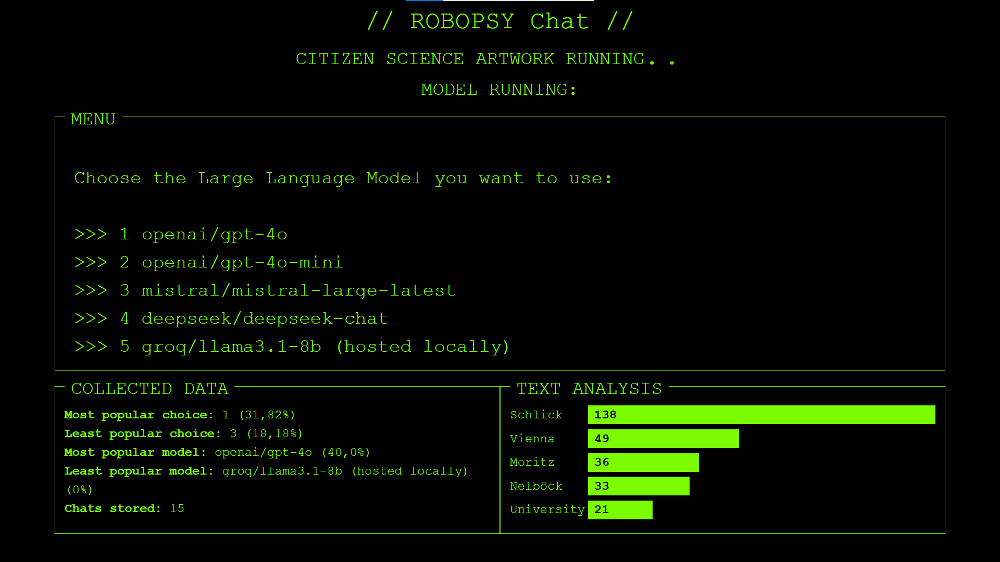
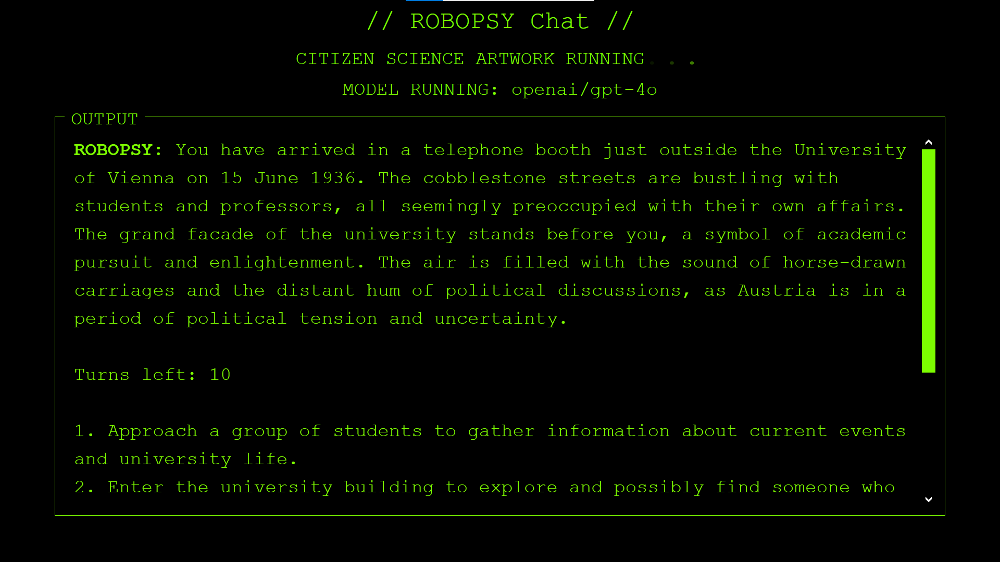

# Robopsy Web Application
*last update: 27.05.2025*

*The Robopsy Web Application (prototpye)* is used to examine the output of different large language models such as gpt4o, llama or deepseek. It is part of the artistic research project *Robopsychologists: An Artistic Exploration of Collective
Memory through Role-Playing with AI Language Models* at the University of Applied Arts Vienna in the Experimental Game Cultures Department.

**Website:** [robopsy.uni-ak.ac.at](robopsy.uni-ak.ac.at)

**GitHub:** [GitHub/OFAI](https://github.com/OFAI/project-robopsy/tree/main/RobopsyApp)

**Funding by WWTF**: [wwtf.at](https://wwtf.at/funding/programmes/ict/ICT23-020/index.php?lang=EN)

### Dependencies
Python version: [Python 3.13.3](https://www.python.org/downloads/release/python-3133/)

The first prototype of this app was developed with [*Django* (Version 4.2.18)](https://docs.djangoproject.com/en/5.2/releases/4.2.18/). 

It uses the [python llms wrapper](https://github.com/OFAI/python-llms-wrapper) developed by the OFAI (Austrian Research Institute for Artificial Intelligence) to communicate with different API-endpoints to complete written prompts. It needs to be cloned installed from here: `pip install git+https://github.com/OFAI/python-llms-wrapper.git`.

The frontend operations (llm selection, user input, display of streamed llm response, etc.) are handeled via [JavaScript](/RobopsyApp/conversation/static/js/script.js).

**Full requirements:** [requirements.txt](requirements.txt)

> ⚠ **Important** ⚠   
> There seems to be an issue on german windows in `python 3.13.3` with encoding in the dependency `litellm` therefore uninstall `litellm` from your virutal environment and clone this specific branch: `git clone --branch issue10272 https://github.com/johann-petrak/litellm.git`. Go into the folder "litellm" and `use pip install .` to install the new, cloned branch of "litellm".

### Usage
#### Run the app

In this stage of the project we use the Django development server. To start it, change your current working directory to `RobopsyApp` then use the command `python .\manage.py runserver` to start the app. You can also add a specific port e.g. `python .\manage.py runserver 8080`

The app will be now accessible under localhost + your port. Default: [localhost:8000](http://localhost:8000)

### Interface

*Model Selection*

The user is asked to chose one out of five large language models by pressing a key.

> ℹ 
> In our exhibition we used a custom made keyboard where the buttons 1-4 and "reset" were mapped to "l", "k", "j", "h" and "g". For this reason there is a workaround in the [JavaScript](/RobopsyApp/conversation/static/js/script.js)-file.

*Model Selection*

After this a streaming response from the selected llm will be shown on screen. The initial prompt is sent automatically and contains instructions about a pen & paper scenario the user then will be playing using the buttons 1-4.

**prompt file:** [here](/RobopsyApp/conversation/static/promptfiles/promptsheet_robopsy_eng.txt)

The "reset" button will save the conversation (including date, time, model) into "saved_chats" as txt.

### Upcoming features
- multiple playmodes
- more sophisticated text analysis, maybe on second screen
- maybe hard coded limitation to a specific number of playrounds (at this point only limited via prompt sheet)

### Known Bugs
- Timestamp for chat messages in protocols is not working properly

 

